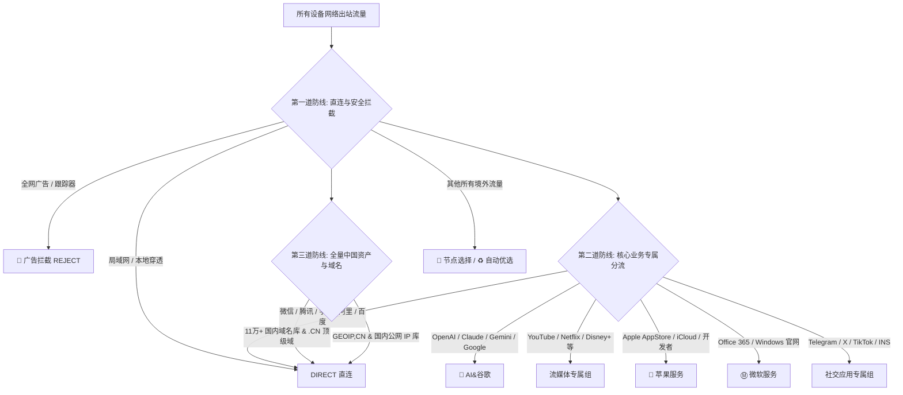

# 🍎 ApexApple: 极致全能跨端代理配置规范

> **释放全平台设备的全部潜能 · 苹果与跨端高级用户的终极分流体验**  
> 一套精心打磨、经历海量网络抓包实测（微信/字节/腾讯/小红书/苹果生态）验证的工业级分流体系。  
> 完美统一 **Clash (Mihomo)**、**Loon**、**Shadowrocket (小火箭)** 三端逻辑与交互体验。

---

## ✨ 核心设计哲学

- **零配置负担，开箱即用**：告别繁琐的节点筛选与策略调试，导入订阅或配置文件即刻畅享丝滑分流。
- **三端 100% 体验对齐**：同一套分流体系、一致的策略组命名、匹配规范与精致的高清渐变图标体系。
- **真·零 DNS 泄露架构**：双轨 DoH 专线隔离，国内走阿里/腾讯 DoH 秒开，海外与节点查询全加密，彻底阻断运营商监听。
- **精准前锋 + 广域防空网**：
  - **前锋精准放行**：内置微信、腾讯、字节（豆包）、阿里、百度专属规则与 UA / ASN 特征，杜绝误代理。
  - **广域防空网**：11 万+ 条全量国内域名库与权威 IP-CIDR 全方位兜底，彻底杜绝国内服务意外走国外代理。
- **双层优雅控制**：
  - **日常省心**：默认自动优选低延迟专线（`url-test` 自动测速）。
  - **随时掌控**：保留两级手动点选组（🕹 标识），随时在几百个节点中精确定位指定落地节点。

---

## 🧭 三端配置文件矩阵

| 客户端平台 | 推荐配置文件 / 订阅配置 | 架构特点 |
| :--- | :--- | :--- |
| **Loon (iOS / macOS)** | [`config/loon/loon_clash.conf`](./config/loon/loon_clash.conf) | 原生支持 DoH、自动优选策略组、全套精美矢量图标、权威上游规则库 |
| **Shadowrocket (小火箭)** | [`config/shadowrocket/shadowrocket.conf`](./config/shadowrocket/shadowrocket.conf) | 1:1 移植 Loon 架构，原生 DOMAIN-SET 高效检索、全加密双轨 DoH 零回落泄露 |
| **Clash / Mihomo** | [`config/paraspace_clash.ini`](./config/paraspace_clash.ini) + [`clash_rule_base.yaml`](./config/clash_rule_base.yaml) | Subconverter 订阅转换基础模板，内置全功能 Fake-IP 白名单与规则分流 |

---

## 🚀 极速上手使用指南

### 1. Loon (iOS / macOS)

1. 打开 **Loon** App，点击底部导航栏的 **「配置」**。
2. 选择 **「从 URL 下载配置」**（Download from URL）。
3. 粘贴本仓库的 Loon 原始配置文件链接：
   ```text
   https://raw.githubusercontent.com/LMuniverse/ApexApple_AE1/main/config/loon/loon_clash.conf
   ```
   *(国内网络环境可使用加速镜像：`https://gh-proxy.com/...`)*
4. 下载成功后激活该配置。
5. 在 **「节点」** -> **「订阅组」** 中，将占位的 `订阅组1` 填入你自己的真实机场订阅链接即可开始使用。

---

### 2. Shadowrocket (小火箭)

1. 打开 **Shadowrocket** App，点击底部 **「配置」** 标签。
2. 点击右上角的 **`+`**，在 URL 框中粘贴：
   ```text
   https://raw.githubusercontent.com/LMuniverse/ApexApple_AE1/main/config/shadowrocket/shadowrocket.conf
   ```
3. 点击 **「下载」**，下载完成后在本地配置文件列表中找到并勾选选中。
4. 随后在首页正常添加或更新你的节点订阅即可，策略组与规则会自动关联生效。

---

### 3. Clash / Clash Verge / Mihomo

本方案采用标准 Subconverter 规则模板：
1. 打开你的订阅转换面板或后端生成器。
2. 基础配置模板参数填入：
   ```text
   https://gh-proxy.com/https://raw.githubusercontent.com/LMuniverse/ApexApple_AE1/refs/heads/main/config/clash_rule_base.yaml
   ```
3. 外部规则配置文件参数填入：
   ```text
   https://gh-proxy.com/https://raw.githubusercontent.com/LMuniverse/ApexApple_AE1/refs/heads/main/config/paraspace_clash.ini
   ```
4. 点击生成订阅并在 Clash Verge / Mihomo 中一键导入。

---

## 🎨 策略组分层与分流逻辑



### 🎯 策略组清单与默认出站行为

- **🚩 节点选择**：全局核心总控策略，默认首选 `♻️ 自动选择`，可自由切换到手动组或指定国家。
- **♻️ 自动选择**：后台每 300 秒探测低延迟优质专线，断网/波动时毫秒级无感热备平移。
- **👋 手动切换**：二级折叠菜单，收纳香港、台湾、日本、韩国、新加坡、美国及全球各区域手动点选组（🕹）。
- **🍎 苹果服务**：默认直连（`DIRECT`）保证 App Store 与 iCloud 满速跑满宽带；遇到特定外区媒体时可切节点。
- **Ⓜ️ 微软服务**：默认直连保证 Teams / Office 下载秒开，支持切代理。
- **💬 AI&谷歌**：精准排除香港节点（防止访问 OpenAI / Claude 报不支持地区），直通高质量亚太与欧美专线。
- **TikTok**：严格排除香港节点，自动路由至解锁 TikTok 的原生落地节点。
- **国内主流社交平台（抖音/小红书/微博/快手/B站/知乎）**：默认直连不消耗专线流量；支持随时切换至香港、台湾或海外节点，轻松管理外宣与账号定位。

---

## 🛡️ 为什么选择本套配置？

1. **权威上游规则维保**：完全告别“个人维护规则不全、频繁失效”的痛点，100% 接入业内标杆 `blackmatrix7` 每日自动化构建仓库。
2. **纯粹轻量，杜绝暗度陈仓**：不内置任何第三方插件、无恶意劫持重写、无繁杂私货，纯粹基于客户端内核原生分流特性。
3. **视觉舒适度拉满**：统一采用标准化 WebP / PNG 高清图标，暗色与亮色模式均能优雅呈现，让你的客户端不仅好用，而且好看。

---

## 📄 鸣谢与开源生态

- 规则集来源：[blackmatrix7/ios_rule_script](https://github.com/blackmatrix7/ios_rule_script)
- 图标库灵感：[AIsouler/MyClash](https://github.com/AIsouler/MyClash)
- 协议内核支持：[MetaCubeX/mihomo](https://github.com/MetaCubeX/mihomo) · [Loon](https://nsloon.app) · [Shadowrocket](https://www.shadowrocket.vip)
